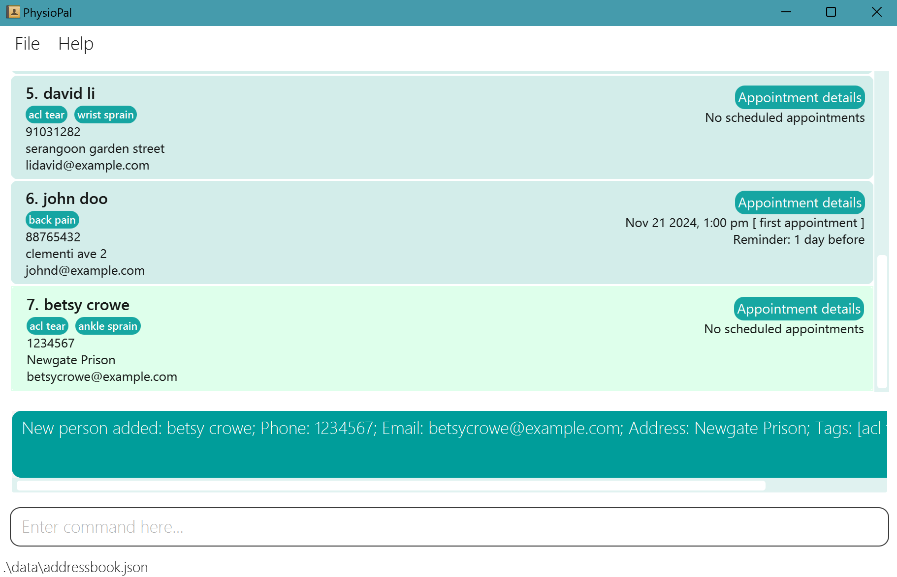
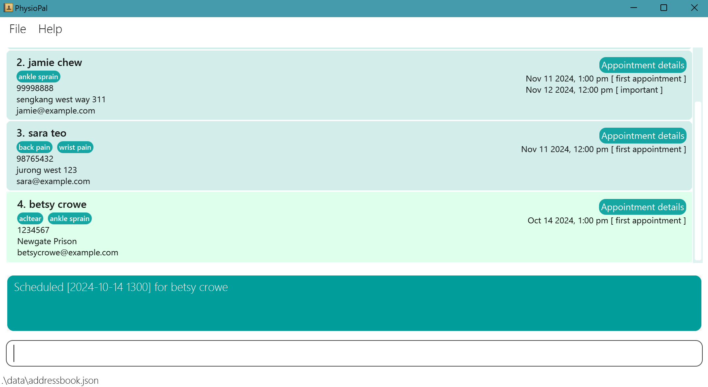
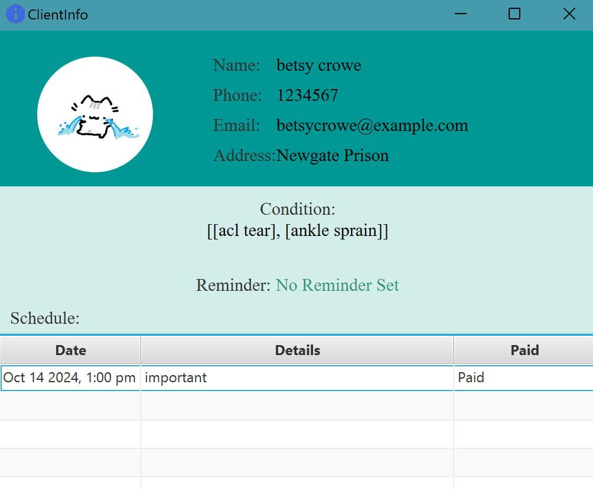
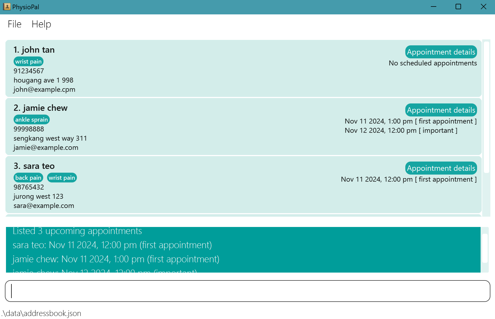
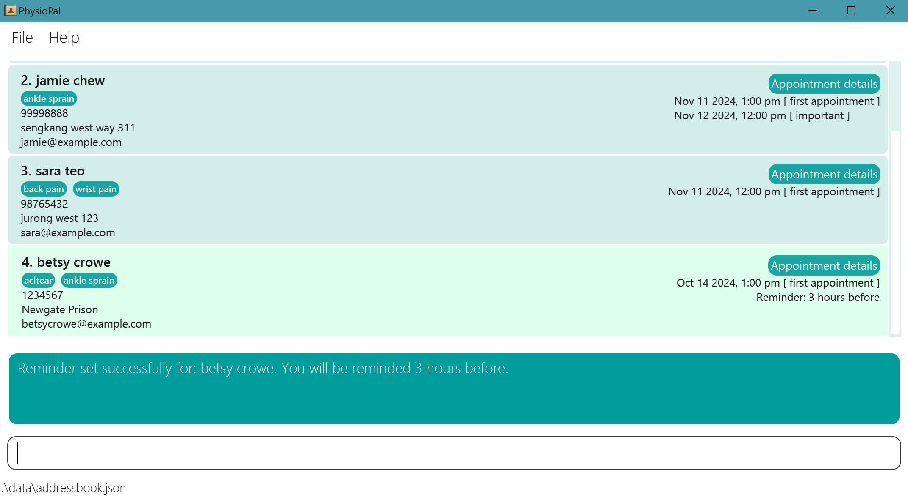
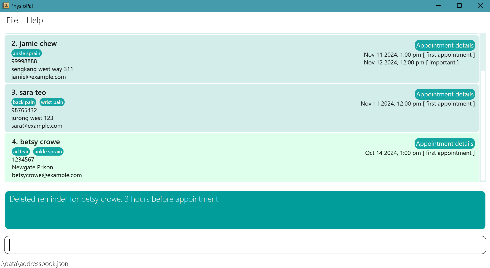

PhysioPal is an **all-in-one, desktop app** specifically created to streamline daily administrative tasks for physiotherapists,
allowing them to focus more on patient care and less on paperwork. By seamlessly **combining the efficiency of a Command Line Interface (CLI)
with the visual ease of a Graphical User Interface (GUI)**, PhysioPal provides a powerful and intuitive way to manage patient records,
schedule appointments, and track payments all in one place. Designed to resolve common challenges—like long search times, duplicate records,
and scheduling conflicts—PhysioPal simplifies client management with rapid commands for quick data entry and retrieval, duplicate checks and a clear
snapshot of all patient details. PhysioPal supports only the English language, ensuring clear and consistent communication across all its features.
The result is a faster, more organised workflow that enables physiotherapists to deliver an exceptional
experience to their clients without being weighed down by administrative burdens.

* Table of Contents
{:toc}

--------------------------------------------------------------------------------------------------------------------

## Quick start

1. Ensure you have Java `17` or above installed in your Computer.

2. Download the latest `.jar` file from [here](https://github.com/AY2425S1-CS2103T-W11-4/tp/releases).

3. Copy the file to the folder you want to use as the _home folder_ for your PhysioPal.

4. Open a command terminal, `cd` into the folder you put the jar file in, and use the `java -jar physiopal.jar` command to run the application. 
   A GUI similar to the below should appear in a few seconds. 
   

5. Type the command in the command box and press Enter to execute it. e.g. typing **`help`** and pressing Enter will open the help window. 
   Some example commands you can try:

   * `list` : Lists all contacts.

   * `add n/John Doe p/98765432 e/johnd@example.com a/John street, block 123, #01-01` : Adds a contact named `john doe` to the Address Book.

   * `delete John Doe` : Deletes the contact named `john doe` in the current list.

   * `edit John Doe n/John Doo` : Edits the name of john doe to john doo.

   * `view John Doe` : Shows the details of john doe.

   * `find John Doe` : Searches for john doe in the current list.

   * `schedule John Doe d/2024-10-14 1200 note/First appointment`: Schedules an appointment for john doe on October 14, 2024, at 12pm with the given note.

   * `appointment-delete John Doe d/2024-10-14 1200` : Deletes a specified appointment for john doe.

   * `appointment-list` : Lists all upcoming scheduled appointments.

   * `payment John Doe d/2024-10-14 1200 pay/paid`: Marks the appointment for john doe on October 14, 2024, at 12pm as paid.

   * `reminder John Doe r/1 hour` : Sets a reminder note for john doe 1 hour before his scheduled appointment.

   * `reminder-delete John Doe` : Deletes the reminder note set for john doe.

   * `clear` : Deletes all contacts.

   * `exit` : Exits the app.

6. Refer to the [Features](#features) below for details of each command.

--------------------------------------------------------------------------------------------------------------------

## Features

**:information_source: Notes about the command format:** 

* Words in `UPPER_CASE` are the parameters to be supplied by the user. 
  e.g. in `add n/NAME`, `NAME` is a parameter which can be used as `add n/John Doe`.

* Items in square brackets are optional. 
  e.g `n/NAME [t/TAG]` can be used as `n/John Doe t/ankle sprain` or as `n/John Doe`.

* Items with `…`​ after them can be used multiple times including zero times. 
  e.g. `[t/TAG]…​` can be used as ` ` (i.e. 0 times), `t/ankle sprain`, `t/anklesprain t/acl tear` etc.

* Parameters can be in any order. 
  e.g. if the command specifies `n/NAME p/PHONE_NUMBER`, `p/PHONE_NUMBER n/NAME` is also acceptable.

* Extraneous parameters for commands that do not take in parameters (such as `help`, `list`, `exit` and `clear`) will be ignored. 
  e.g. if the command specifies `help 123`, it will be interpreted as `help`.

* The parameter `NAME` is <b>unique</b> and <b>case-insensitive</b> across all commands that require it, and it will be displayed in lowercase.

* If you are using a PDF version of this document, be careful when copying and pasting commands that span multiple lines as space characters surrounding line-breaks may be omitted when copied over to the application.

### Viewing help : `help`

Shows a message explaning how to access the help page.

Format: `help`

### Adding a person: `add`

Adds a person to the address book.

Format: `add n/NAME p/PHONE_NUMBER e/EMAIL a/ADDRESS [t/TAG]…​`

:bulb: **Tip:**
A person can have any number of tags (including 0)

* The parameter `NAME` is <b>unique</b> and <b>case-insensitive</b>, and it will be displayed in lowercase.
* Persons in PhysioPal can share the same phone number, email and address.
* Persons with dashes, commas, slashes and periods in name should be omitted. For example,
  persons with `s/o` or `d/o` in name should be entered as `s o` and `d o` respectively.

Examples:
* `add n/John Doe p/98765432 e/johnd@example.com a/John street, block 123, #01-01`
* `add n/Betsy Crowe t/acl tear e/betsycrowe@example.com a/Newgate Prison p/1234567 t/ankle sprain` 
  

### Editing a person : `edit`

Edits an existing person in the address book.

Format: `edit NAME [n/NAME] [p/PHONE] [e/EMAIL] [a/ADDRESS] [t/TAG]…​`

* Edits the person with the specified `NAME`. The name refers to the name shown in the displayed person list.
* At least one of the optional fields must be provided.
* Existing values will be updated to the input values.
* When editing tags, the existing tags of the person will be removed i.e adding of tags is not cumulative.
* You can remove all the person’s tags by typing `t/` without
  specifying any tags after it.
* Conditions for each field is the same as the `add` command.

Examples:
*  `edit John Doe p/91234567 e/johndoe@example.com` Edits the phone number and email address of the person named `john doe` to be `91234567` and `johndoe@example.com` respectively.
*  `edit Betsy Crowe n/Betsy Crower t/` Edits the person with the name `betsy crowe` to be `betsy crower` and clears all existing tags.

### Deleting a person : `delete`

Deletes the specified person from the address book.

Format: `delete NAME`

* Deletes the person with the specified `NAME`.
* The name must be the name of an existing person.

Examples:
* `delete John Doe` deletes the person named `john doe` in the address book.

### Listing all persons : `list`

Shows a list of all persons in the address book.

Format: `list`

### Viewing a person: `view NAME`

Displays the details of a person in the address book.

**Format:** `view NAME`

:bulb: **Tip:**
The name must match the full name exactly

**On success:** A pop-up window will show the details including:
- Name
- Phone Number
- Email
- Address
- Condition
- Schedule
- Reminder Note

**Note:** Pressing `Esc` closes the pop-up window and refocuses on the command input bar in the main window.

**Examples:**
* `view John Doe`
* `view Jamie Chew` 
   

### Locating persons: `find`

Finds persons whose names contain any of the given keywords.

Format: `find [KEYWORD] [MORE_KEYWORDS] || [p/PHONE]`

* The search is case-insensitive. e.g `hans` will match `Hans`
* The order of the keywords does not matter. e.g. `hans bo` will match `bo hans`
* Only the name or the number is searched.
* Persons matching at least one keyword (or parts of it) will be returned (i.e. `OR` search).
  e.g. `Hans Bo` will return `hans gruber`, `bo yang`
* Persons matching the phone number (or parts of it) will be returned

Examples:
* `find john` returns `john` and `john doe`
* `find alex david` returns `alex yeoh`, `david li` 
   
* `find p/887` returns `john doo` (with phone number `88765432`)  
  

### Scheduling an appointment: `schedule`

Schedules an appointment for a client in the address book.

Format: `schedule NAME d/DATE_AND_TIME…​ note/NOTES…​`

:bulb: **Tip:**
You can schedule multiple appointments using the `d/` prefix for each date and time

* If multiple `note/` prefixes are used, each note will correspond to the `d/` in the same order. Same number of notes and dates must be provided.
* The given date and time must fall on a weekday and on the hour between 0900 and 1600 inclusive.
* Format for the date and time must be in yyyy-MM-dd HHmm.
* When scheduling appointments, the existing schedules of the person will be removed i.e adding of schedules is not cumulative.

:information_source: **Note:** Repeated parameters for `DATE_AND_TIME`,
such as `schedule John Doe d/2024-11-11 1200 note/first d/2024-11-11 1200 note/second`, will be ignored, with only the first instance being processed.

Examples:
* `schedule John Doe d/2024-10-14 1200 note/first appointment`
* `schedule John Doe d/2024-10-15 1200 d/2024-10-16 1300 note/important meeting note/not so important meeting`
* `schedule Betsy Crowe d/2024-10-14 1300 note/first appointment` 
  

### Deleting an appointment: `appointment-delete`

Deletes a specified appointment for a client in the address book.

Format: `appointment-delete NAME d/DATE_AND_TIME`

* The given name must be the name of an existing client.
* The given date and time must be in the format yyyy-MM-dd HHmm.
* The appointment given must be an existing appointment for the client.

Examples:
* `appointment-delete Betsy Crowe d/2024-10-14 1300` 
  

### Making Payment for an appointment: `payment`

Marks an appointment for a client as paid or unpaid.

Format: `payment NAME d/DATE_AND_TIME pay/PAYMENT_STATUS`

* Format for the date and time must be in yyyy-MM-dd HHmm.
* Payment status can be in the format [paid or unpaid] and will be shown in the client tab.

Examples:
* `payment John Doe d/2024-10-14 1200 pay/unpaid`
* `payment Betsy Crowe d/2024-10-14 1300 pay/paid` 
   

### Viewing upcoming appointments: `appointment-list`

Lists all upcoming appointments in the order of the earliest next upcoming appointment.

Format: `appointment-list [d/DATE][TIME]`

:bulb: **Tip:**
The optional date and time fields act as filters

* This will only show appointments that are in the **future** (compared to local time now).
* A time filter cannot be applied without date filter.
* Format for the date and time must be in yyyy-MM-dd HHmm.

Examples:
* `appointment-list` 
   
* `appointment-list d/2024-10-17`
    Displays all appointments scheduled for October 17, 2024, if this date has not yet passed the current local date.
* `appointment-list d/2024-10-18 1000` 
    Displays the appointment scheduled for October 17, 2024, 10:00am, if this date and time has not yet passed the current local date and time

### Setting a reminder note: `reminder`

Sets a reminder note for a client before their appointment in the address book.

Format: `reminder NAME r/REMINDER_TIME`

:bulb: **Tip:**
You can only set a reminder note for a person who already has a scheduled appointment

* The NAME refers to the full name of the client you want to set a reminder for.
* The REMINDER_TIME specifies how early you want to be reminded before the appointment. It must be in the form of either "X day(s)" or "Y hour(s)".
* ***Allowed reminder times***:
    * Days: You can specify 1 to 7 days (e.g 1 day, 7 days)
    * Hours: You can specify 1 to 23 hours (e.g 1 hour, 23 hours)
* Multiple reminder times (r/) cannot be specified in a single command. Only one reminder time can be set per command.

Examples:
* `reminder John Doe r/6 days`
* `reminder Betsy Crowe r/3 hours` 
  

### Deleting a reminder note: `reminder-delete`

Deletes a reminder note for a client in the address book.

Format: `reminder-delete NAME`

* You can only delete a reminder note for a person who has at least one scheduled appointment.
* The given name must be the name of an existing client.
* You can only delete a reminder note if the reminder note has been set.

Examples:
* `reminder-delete Betsy Crowe` 
  

### Clearing all entries : `clear`

Clears all entries from the address book.

Format: `clear`

### Exiting the program : `exit`

Exits the program.

Format: `exit`

### Showing Top 3 Upcoming Appointments

Automatically displays the top 3 upcoming appointments for all contacts when you open up PhysioPal.

* This feature operates automatically upon application launch, so there is no need for any user commands.
* If there are fewer than three upcoming appointments, the list will show all available appointments.
* This will only show appointments that are in the **future** (compared to local time now).

Example display:

### Saving the data

PhysioPal data are saved in the hard disk automatically after any command that changes the data. There is no need to save manually.

### Editing the data file

PhysioPal data are saved automatically as a JSON file `[JAR file location]/data/addressbook.json`. Advanced users are welcome to update data directly by editing that data file.

:exclamation: **Caution:**
If your changes to the data file makes its format invalid, PhysioPal will discard all data and start with an empty data file at the next run. Hence, it is recommended to take a backup of the file before editing it. 
Furthermore, certain edits can cause the PhysioPal to behave in unexpected ways (e.g., if a value entered is outside of the acceptable range). Therefore, edit the data file only if you are confident that you can update it correctly.

--------------------------------------------------------------------------------------------------------------------

## Glossary

* **Appointment**: A 1-hour scheduled meeting between a physiotherapist and a client for treatment. It includes date and time.
* **Appointment details**: Information on the appointment including date, time, notes and payment details.
* **Client**: A person receiving services from the physiotherapist. He/she should have 
a unique name (not case-sensitive).
* **Client contact detail**: A contact detail that includes name, phone number, email address,
  address, appointment details, tags etc.
* **Condition**: The client's specific physical or functional impairment, injury, or disorder that affects movement,
strength, flexibility, or overall physical function.
* **Notes**: Additional information on the appointment (e.g. urgency, treatment record).
* **Reminder Note**: An entry saved for a specific time before a client's scheduled appointment in the address book, it serves as a record to help the physiotherapist keep track of when they need to follow up with the client.
* **Tag**: A label to indicate the treatment type of the client.

--------------------------------------------------------------------------------------------------------------------

## FAQ

**Q**: How do I transfer my data to another Computer? 
**A**: Install the app in the other computer and overwrite the empty data file it creates with the file that contains the data of your previous PhysioPal home folder.

--------------------------------------------------------------------------------------------------------------------

## Known issues

1. **When using multiple screens**, if you move the application to a secondary screen, and later switch to using only the primary screen, the GUI will open off-screen. The remedy is to delete the `preferences.json` file created by the application before running the application again.
2. **If you minimize the Help Window** and then run the `help` command (or use the `Help` menu, or the keyboard shortcut `F1`) again, the original Help Window will remain minimized, and no new Help Window will appear. The remedy is to manually restore the minimized Help Window.

--------------------------------------------------------------------------------------------------------------------

## Command summary

Action | Format, Examples
--------|------------------
**Add** | `add n/NAME p/PHONE_NUMBER e/EMAIL a/ADDRESS [t/TAG]…​`   e.g., `add n/James Ho p/22224444 e/jamesho@example.com a/123, Clementi Rd, 1234665 t/ankle sprain t/acl tear`
**Appointment Delete** | `appointment-delete NAME d/DATE_AND_TIME`  e.g., `appointment-delete John Doe d/2024-10-20 1100`
**Appointment List** | `appointment-list [d/DATE][TIME]`   e.g., `appointment-list d/2024-10-20 1100`
**Clear** | `clear`
**Delete** | `delete NAME`  e.g., `delete John Doe`
**Edit** | `edit NAME [n/NAME] [p/PHONE_NUMBER] [e/EMAIL] [a/ADDRESS] [t/TAG]…​`  e.g.,`edit James n/James Lee e/jameslee@example.com`
**Find** | `find [KEYWORD] [MORE_KEYWORDS] / [p/PHONE]`  e.g., `find James Jake` `find p/8357 2348`
**Help** | `help`
**List** | `list`
**Payment** | `payment NAME d/DATE_and_TIME pay/PAYMENT_STATUS`   e.g., `payment John Doe 2024-10-20 1100 pay/paid`
**Reminder** | `reminder NAME r/REMINDER_TIME`
**Reminder Delete** | `reminder-delete NAME`
**Schedule** | `schedule NAME d/DATE_AND_TIME…​ note/NOTES…​`
**View** | `view NAME`
